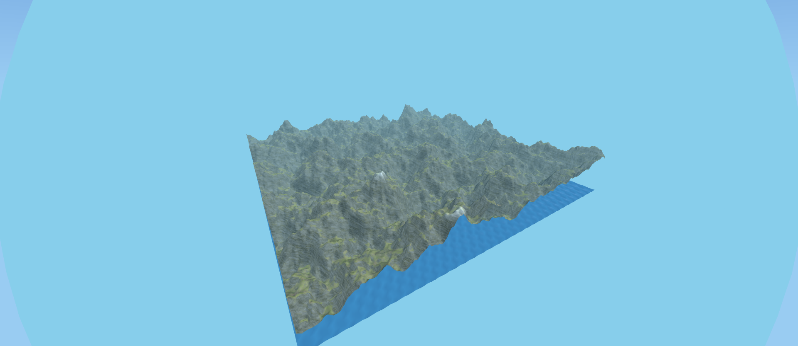
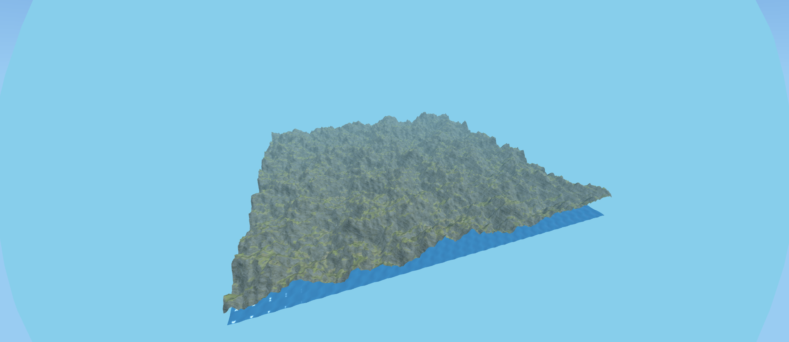

# 🏔️ Procedural Terrain Generator 3D

[](https://opensource.org/licenses/MIT)
[](https://en.wikipedia.org/wiki/C_(programming_language))
[](https://webassembly.org/)
[](https://threejs.org/)

Real-time 3D procedural terrain generation using C/WebAssembly for high-performance computation and Three.js for rendering.

[📺 Live Demo](https://sofianebeloucif.github.io/procedural-terrain-3d/) | [📖 Technical Documentation](docs/TECHNICAL.md)


## ✨ Features

### **Core Capabilities**
* 🚀 **High Performance**: Terrain generation implemented in C, compiled to WebAssembly for native speed.
* 🏞️ **Multi-Biome Shading**: Sophisticated texture blending for **Sand, Grass, Rock, and Snow** based on height and slope.
* 🌊 **Realistic Water**: Dynamic water plane with wave simulation and improved Fresnel effects.
* 🎨 **Procedural Generation**: Utilizes Simplex noise with Fractal Brownian Motion (FBM) for complex, natural looking landscapes.
* 🎮 **Interactive 3D**: Real-time orbit camera controls.
* ⚙️ **Customizable**: Adjust all noise and biome parameters in real-time via the integrated UI.
* 💾 **Export**: Save the generated terrain mesh as an **OBJ file** for external 3D software (Blender, Maya).

### **Technical Highlights**
* **Simplex Noise**: Implementation of the superior Simplex algorithm (replacing Perlin).
* **FBM**: Configurable parameters: **octaves, persistence, and lacunarity**.
* **Automatic Normals**: Accurate normal calculation for realistic lighting and shading.
* **Tri-Planar Mapping**: Used for seamless texture application on steep surfaces (rocks).
* **Optimized Mesh Generation**: Efficient indexing and memory handling via WASM.

---

## 🚀 Quick Start

### **Prerequisites**
- **Emscripten** (for building C to WebAssembly)
- A modern web browser with WebAssembly support
- Local web server (Python, Node.js, or similar)

### **Installation**

1. **Clone the repository**
```bash
git clone https://github.com/yourusername/procedural-terrain-3d.git
cd procedural-terrain-3d
```

2. **Install Emscripten**
```bash
# Download and install Emscripten SDK
git clone https://github.com/emscripten-core/emsdk.git
cd emsdk
./emsdk install latest
./emsdk activate latest
source ./emsdk_env.sh
cd ..
```

3. **Build WebAssembly**
```bash
cd c
chmod +x build.sh
./build.sh
cd ..
```

4. **Start local server**
```bash
# Using Python 3
python -m http.server 8000

# Or using Node.js
npx serve

# Or using PHP
php -S localhost:8000
```

5. **Open in browser**
```
http://localhost:8000
```

## 🎮 Usage

### **Basic Controls**
- **Left Mouse + Drag**: Rotate camera around terrain
- **Right Mouse + Drag**: Pan camera
- **Mouse Wheel**: Zoom in/out
- **Space**: Reset camera to default position

### **Terrain Generation**
1. Open the settings panel (⚙️ icon)
2. Adjust parameters:
    - **Seed**: Random seed for reproducible terrain
    - **Resolution**: Grid size (64x64 to 512x512)
    - **Scale**: Zoom level of noise function
    - **Height**: Vertical terrain scale
    - **Octaves**: Level of detail (more = more details)
    - **Persistence**: Amplitude decay between octaves
    - **Lacunarity**: Frequency increase between octaves
3. Click "Generate Terrain"

### **Presets**
Try predefined terrain types:
- 🏔️ **Mountains**: High peaks with valleys
- 🌄 **Hills**: Gentle rolling hills
- 🌾 **Plains**: Mostly flat with small variations
- 🏝️ **Islands**: Archipelago-like terrain
- 🏜️ **Desert**: Sand dunes and plateaus
- 🏞️ **Canyon**: Deep valleys and cliffs

### **Exporting**
- **Screenshot**: 📸 button - Save current view as PNG
- **OBJ Export**: 💾 button - Export 3D model for Blender, Maya, etc.

## 🛠️ Technology Stack

### **Backend (Generation)**
* **C**: Core logic for noise generation and mesh construction.
* **WebAssembly (.wasm)**: High-speed execution of C code in the browser.
* **Emscripten**: Toolchain for compiling C to WASM.

### **Frontend (Rendering & UI)**
* **Three.js**: Main 3D rendering library built on WebGL.
* **WebGL**: GPU-accelerated graphics for fast drawing.
* **Vanilla JavaScript / CSS3**: UI and application logic.

### **Algorithms**
* Simplex Noise
* Fractal Brownian Motion (FBM)
* Height/Slope/Moisture based Biome Mapping
* Optimized Indexing (Mesh Generation)

---


## 🎨 Screenshots

| Mountains | Islands | Desert |
|-----------|---------|--------|
|  |  |  |

## 📚 Documentation

### **Algorithm Details**

The terrain complexity is achieved primarily through Fractal Brownian Motion (FBM), which layers multiple octaves of Simplex Noise.

**Fractal Brownian Motion (FBM)**
$$
\text{fbm}(x, y) = \sum_{i=0}^{\text{Octaves}-1} \text{amplitude}[i] \cdot \text{noise}(\text{frequency}[i] \cdot x, \text{frequency}[i] \cdot y)
$$
Where $\text{amplitude}[i] = \text{persistence}^i$ and $\text{frequency}[i] = \text{lacunarity}^i$.


**Biome Selection**
```
if (height < uSandLevel) → Sand
else if (height < uGrassStart) → Grass (with sand blend)
else if (slope < uRockSlope) → Grass/Forest
else if (height > uSnowLevel) → Snow
else → Rock (High Slope)
```

See [Technical Documentation](docs/TECHNICAL.md) for more details.

## 🤝 Contributing

Contributions are welcome! Please feel free to submit a Pull Request.

1. Fork the project
2. Create your feature branch (`git checkout -b feature/AmazingFeature`)
3. Commit your changes (`git commit -m 'Add some AmazingFeature'`)
4. Push to the branch (`git push origin feature/AmazingFeature`)
5. Open a Pull Request

## 📝 License

This project is licensed under the MIT License - see the [LICENSE](LICENSE) file for details.

## 👤 Author

Sofiane Beloucif
- Portfolio: [sofianebeloucif.com](#)
- GitHub: [@sofianebeloucif](https://github.com/yourusername)


## 🙏 Acknowledgments

* **Ken Perlin** for the Simplex Noise algorithm: [https://cs.nyu.edu/~perlin/](https://cs.nyu.edu/~perlin/)
* **Three.js** community: [https://threejs.org/](https://threejs.org/)
* **Emscripten** developers: [https://emscripten.org/](https://emscripten.org/)
* **Sebastian Lague's** procedural terrain tutorials: [https://www.youtube.com/c/SebastianLague](https://www.youtube.com/c/SebastianLague)
* **The Book of Shaders**: [https://thebookofshaders.com/](https://thebookofshaders.com/)
## 🔮 Future Enhancements

- [ ] Infinite terrain (chunk system)
- [ ] Advanced erosion simulation
- [ ] Vegetation placement
- [ ] Water shader with reflections
- [ ] Multiple LOD levels
- [ ] Texture generation
- [ ] Cave systems
- [ ] Real-time editing tools


---

⭐ If you find this project useful, please consider giving it a star!